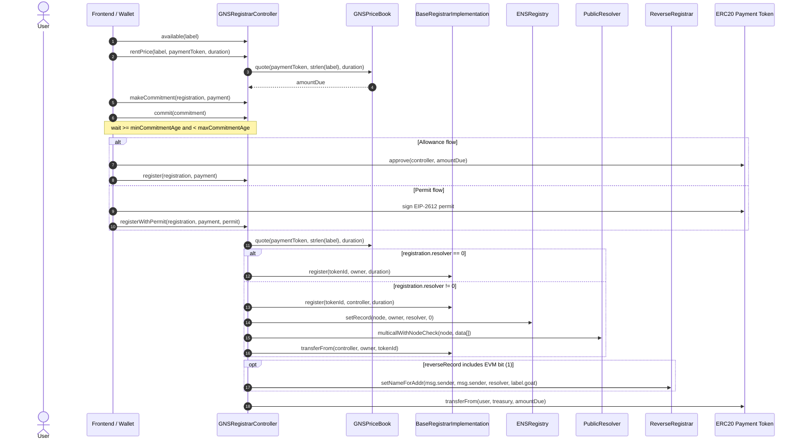
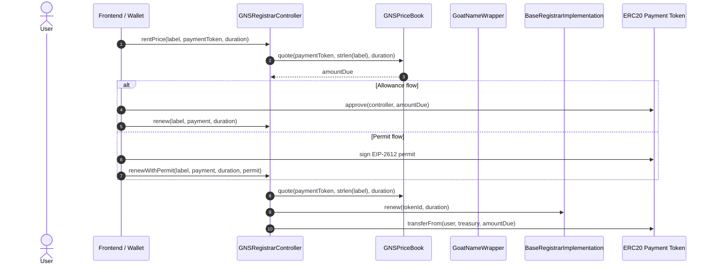
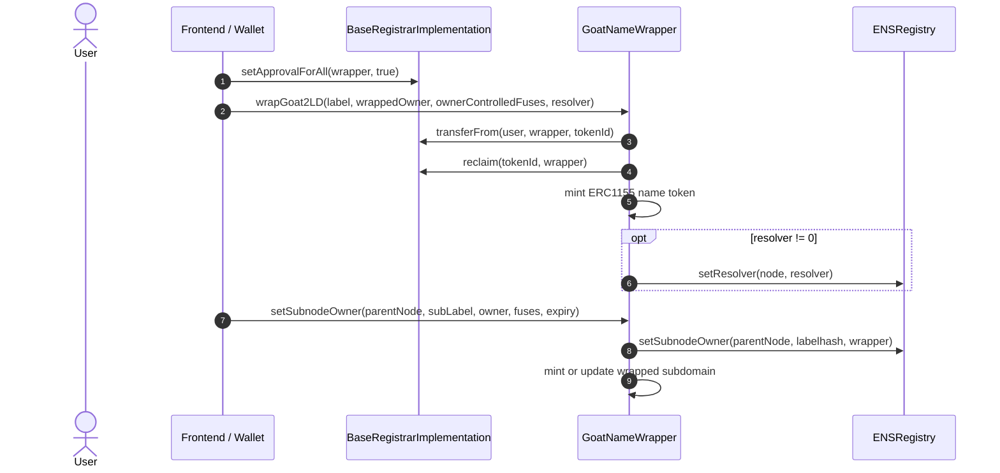

# Goat Name Service

An ENS-compatible `.goat` name service built on Hardhat 3, `node:test`, and `viem`.

## Stack

- ENS upstream contracts: `ENSRegistry`, `BaseRegistrarImplementation`, `PublicResolver`, `ReverseRegistrar`, `StaticMetadataService`
- Custom contracts: `GNSPriceBook`, `GNSRegistrarController`, `GoatNameWrapper`
- Payment bridge: `GNSX402Adaptor` for x402 callback-driven registration and renewal execution
- Deployment: Hardhat Ignition module at `ignition/modules/GNS.ts`
- Tests: integration coverage in `test/GNS.ts`

## Features

- `.goat` ENS-style registry, resolver, reverse registrar, registrar, and wrapper stack
- Fixed-price ERC20 registrations and renewals for normalized labels with length `3+`
- Per-token annual pricing buckets for `3`, `4`, and `5+` byte names
- `approve + transferFrom` and EIP-2612 `permit` payment flows
- x402 callback adaptor flow for exact-amount registrations and renewals
- ENS-style `commit -> wait -> register` flow for new registrations
- Manual `.goat` wrapping, wrapped-name renewals, and wrapped subdomain management

## Requirements

- Final acceptance target: Node 22 LTS
- Local development in this workspace currently runs on Node 25, which Hardhat warns about but still compiled and ran the test suite during implementation

## Usage

Install dependencies:

```sh
npm ci
```

Compile contracts:

```sh
npm run compile
```

Run the integration test suite:

```sh
npm test
```

## Deployment Notes

The Ignition module deploys and initializes the full `.goat` stack in one flow:

1. Deploy `ENSRegistry`, `.goat` `BaseRegistrarImplementation`, `ReverseRegistrar`, `StaticMetadataService`, `GoatNameWrapper`, `GNSPriceBook`, `GNSRegistrarController`, and `PublicResolver`
2. Initialize `reverse` and `addr.reverse`
3. Install `.goat` resolver records and interface records for the controller and wrapper
4. Transfer `.goat` ownership to the base registrar
5. Authorize the controller on the registrar, wrapper, and reverse registrar

The module defaults the treasury to the deployer account and exposes configurable `metadataUri`, `minCommitmentAge`, and `maxCommitmentAge` parameters.
It also deploys `GNSX402Adaptor` with a configurable `x402AuthorizedCaller`, but no frontend or backend x402 orchestration is wired in this repository yet.

## Contract Roles

- `ENSRegistry`: canonical ownership, resolver, and reverse-record registry for the `.goat` stack
- `BaseRegistrarImplementation`: ERC721 registrar for `.goat` second-level names; it owns `namehash("goat")`
- `GNSRegistrarController`: fixed-price commit/reveal entrypoint for registrations and renewals, with ERC20 and EIP-2612 payment support
- `GNSX402Adaptor`: x402 callback target that verifies signed callback payloads, pulls ERC20 tokens from the payer, and forwards exact-price `register` and `renew` calls into the controller
- `GNSPriceBook`: whitelisted ERC20 pricing table with separate annual buckets for `3`, `4`, and `5+` character labels
- `GoatNameWrapper`: optional ERC1155 wrapper for `.goat` names and subdomains with ENS-compatible fuse semantics
- `PublicResolver`: stores `addr`, `text`, reverse-name data, and the interface records published for the controller and wrapper

## Contract Sequence Diagrams

### New Registration



The commitment hash binds the full `registration` struct plus the `payment` struct. If the user changes the owner, resolver, payment token, or `maxPaymentAmount`, the frontend must recompute the commitment and submit a new `commit`.

### Renewal



Controller renewals now follow the ENS upstream `ETHRegistrarController` pattern and call `BaseRegistrarImplementation.renew` directly. `GoatNameWrapper` remains optional and is not part of the controller renewal path.

### X402 Callback Adaptor

`GNSX402Adaptor` is the protocol-side x402 callback target. It follows the same high-level pattern as GoLucky:

- the configured x402 caller triggers the adaptor callback
- the adaptor verifies the user's EIP-712 calldata signature, nonce, and deadline
- the adaptor pulls ERC20 tokens from the payer via EIP-3009 or Permit2
- the adaptor decodes the callback payload and forwards the exact registration or renewal call into `GNSRegistrarController`

Current adaptor constraints:

- only configured authorized callers can execute x402 callbacks
- only the `WithCalldata` callback variants are supported, because GNS registration and renewal parameters cannot be inferred from payment amount alone
- payment amounts must exactly match the live controller quote
- reverse-record setup is rejected on the adaptor path because the controller would otherwise assign reverse records to the adaptor itself

### Manual Wrapping and Subdomain Creation



Registrations are intentionally unwrapped in v1. If the UI wants fuse-based permissions or wrapped subdomains, it must call `wrapGoat2LD` after registration succeeds.

## Wallet and Frontend Integration Guide

### What The Frontend Needs

Ship these addresses from the Ignition deployment output or an environment-specific config:

- `gnsRegistrarController`
- `goatNameWrapper`
- `publicResolver`
- `baseRegistrar`
- one or more supported ERC20 payment token addresses

Useful constants:

- `GOAT_NODE = namehash("goat")`
- `REVERSE_RECORD_ETHEREUM = 1`
- `MIN_REGISTRATION_DURATION = 28 days`

The deployment also installs interface records on `.goat`, so indexers or advanced clients can discover the controller and wrapper through `PublicResolver.interfaceImplementer`.

### Minimal `viem` Setup

The snippets below assume you already imported the contract ABIs from your Hardhat artifacts or a shared package.

```typescript
import "viem/window";
import {
  createPublicClient,
  createWalletClient,
  custom,
  encodeFunctionData,
  http,
  parseSignature,
  toHex,
  zeroAddress,
  zeroHash,
} from "viem";
import { normalize, namehash } from "viem/ens";

const publicClient = createPublicClient({
  chain,
  transport: http(rpcUrl),
});

const walletClient = createWalletClient({
  chain,
  transport: custom(window.ethereum),
});

const [account] = await walletClient.requestAddresses();
```

### Register A Name

```typescript
const duration = 365n * 24n * 60n * 60n;
const label = normalize(userInputLabel);
const node = namehash(`${label}.goat`);

// https://docs.ens.domains/ensip/11/
const convertEVMChainIdToCoinType = (chainId: number) => {
  return (0x80000000 | chainId) >>> 0;
};

const amountDue = await publicClient.readContract({
  address: gnsRegistrarController,
  abi: gnsRegistrarControllerAbi,
  functionName: "rentPrice",
  args: [label, paymentToken, duration],
});

const chainId = await publicClient.getChainId();

const resolverData =
  resolverAddress === zeroAddress
    ? []
    : [
        encodeFunctionData({
          abi: publicResolverAbi,
          functionName: "setAddr",
          // Don't use `setAddr` without coinType! The default coinType is 60 (ETH)
          args: [node, convertEVMChainIdToCoinType(chainId), account],
        }),
        encodeFunctionData({
          abi: publicResolverAbi,
          functionName: "setText",
          args: [node, "url", profileUrl],
        }),
      ];

const registration = {
  label,
  owner: account,
  duration,
  secret: toHex(crypto.getRandomValues(new Uint8Array(32))),
  resolver: resolverAddress,
  data: resolverData,
  reverseRecord: resolverAddress === zeroAddress ? 0 : 1,
  referrer: zeroHash,
} as const;

const payment = {
  paymentToken,
  maxPaymentAmount: amountDue,
} as const;

const commitment = await publicClient.readContract({
  address: gnsRegistrarController,
  abi: gnsRegistrarControllerAbi,
  functionName: "makeCommitment",
  args: [registration, payment],
});

const commitHash = await walletClient.writeContract({
  account,
  address: gnsRegistrarController,
  abi: gnsRegistrarControllerAbi,
  functionName: "commit",
  args: [commitment],
});
await publicClient.waitForTransactionReceipt({ hash: commitHash });

const minCommitmentAge = await publicClient.readContract({
  address: gnsRegistrarController,
  abi: gnsRegistrarControllerAbi,
  functionName: "minCommitmentAge",
});

// Replace this with a UI countdown or chain-time poll in production.
await new Promise((resolve) =>
  setTimeout(resolve, Number(minCommitmentAge) * 1000),
);

const approveHash = await walletClient.writeContract({
  account,
  address: paymentToken,
  abi: erc20Abi,
  functionName: "approve",
  args: [gnsRegistrarController, amountDue],
});
await publicClient.waitForTransactionReceipt({ hash: approveHash });

const registerHash = await walletClient.writeContract({
  account,
  address: gnsRegistrarController,
  abi: gnsRegistrarControllerAbi,
  functionName: "register",
  args: [registration, payment],
});
await publicClient.waitForTransactionReceipt({ hash: registerHash });
```

`registration.data` must contain resolver calldata, not controller calldata. The controller forwards it through `PublicResolver.multicallWithNodeCheck(node, data[])`.

### Use EIP-2612 Instead Of `approve`

For tokens that support permits, replace the `approve` call with `registerWithPermit` or `renewWithPermit`:

```typescript
const nonce = await publicClient.readContract({
  address: paymentToken,
  abi: erc20PermitAbi,
  functionName: "nonces",
  args: [account],
});

const tokenName = await publicClient.readContract({
  address: paymentToken,
  abi: erc20PermitAbi,
  functionName: "name",
});

const deadline = BigInt(Math.floor(Date.now() / 1000) + 3600);
const signature = await walletClient.signTypedData({
  account,
  domain: {
    chainId: await publicClient.getChainId(),
    name: tokenName,
    verifyingContract: paymentToken,
    version: "1",
  },
  types: {
    Permit: [
      { name: "owner", type: "address" },
      { name: "spender", type: "address" },
      { name: "value", type: "uint256" },
      { name: "nonce", type: "uint256" },
      { name: "deadline", type: "uint256" },
    ],
  },
  primaryType: "Permit",
  message: {
    owner: account,
    spender: gnsRegistrarController,
    value: amountDue,
    nonce,
    deadline,
  },
});

const { r, s, yParity } = parseSignature(signature);

await walletClient.writeContract({
  account,
  address: gnsRegistrarController,
  abi: gnsRegistrarControllerAbi,
  functionName: "registerWithPermit",
  args: [
    registration,
    payment,
    {
      value: amountDue,
      deadline,
      v: yParity + 27,
      r,
      s,
    },
  ],
});
```

`renewWithPermit` uses the same permit shape; pass `[label, renewPayment, duration, permit]` instead of the approval flow arguments.

### Wrap After Registration And Create Subdomains

```typescript
const label = normalize("wrapme");
const node = namehash(`${label}.goat`);

await walletClient.writeContract({
  account,
  address: baseRegistrar,
  abi: baseRegistrarAbi,
  functionName: "setApprovalForAll",
  args: [goatNameWrapper, true],
});

await walletClient.writeContract({
  account,
  address: goatNameWrapper,
  abi: goatNameWrapperAbi,
  functionName: "wrapGoat2LD",
  args: [label, account, 1, publicResolver],
});

const [, , wrappedExpiry] = await publicClient.readContract({
  address: goatNameWrapper,
  abi: goatNameWrapperAbi,
  functionName: "getData",
  args: [BigInt(node)],
});

await walletClient.writeContract({
  account,
  address: goatNameWrapper,
  abi: goatNameWrapperAbi,
  functionName: "setSubnodeOwner",
  args: [node, "vault", account, 65537, wrappedExpiry],
});
```

In the example above:

- `1` is `CANNOT_UNWRAP`
- `65537` is `PARENT_CANNOT_CONTROL | CANNOT_UNWRAP`

If your frontend exposes fuse controls, source the constants from the ENS wrapper interface instead of duplicating magic numbers in multiple places.

### Renewal Example

```typescript
const renewPrice = await publicClient.readContract({
  address: gnsRegistrarController,
  abi: gnsRegistrarControllerAbi,
  functionName: "rentPrice",
  args: [label, paymentToken, duration],
});

const renewPayment = {
  paymentToken,
  maxPaymentAmount: renewPrice,
} as const;

await walletClient.writeContract({
  account,
  address: paymentToken,
  abi: erc20Abi,
  functionName: "approve",
  args: [gnsRegistrarController, renewPrice],
});

await walletClient.writeContract({
  account,
  address: gnsRegistrarController,
  abi: gnsRegistrarControllerAbi,
  functionName: "renew",
  args: [label, renewPayment, duration],
});
```

## Frontend Guardrails

- Always run `normalize(label)` before `available`, `rentPrice`, `commit`, `register`, or `renew`
- Labels shorter than `3` Unicode code points are rejected
- The commitment must be built from the exact same `registration` and `payment` objects that will be passed to `register`
- If `resolver == zeroAddress`, then `data` must be empty and `reverseRecord` must be `0`
- `maxPaymentAmount` is the caller's safety cap; pass the latest `rentPrice` quote or a deliberate buffer
- Supported payment tokens are configured in `GNSPriceBook`; unsupported tokens revert
- The controller assumes standard ERC20 semantics; fee-on-transfer, rebasing, and ERC777 hook behaviors are unsupported
- Registrations are unwrapped by default in v1; wrapping is a separate user action
- Wrapped and unwrapped names both renew through `GNSRegistrarController`
- Use `NameRegistered`, `NameRenewed`, `NameWrapped`, `NameUnwrapped`, `FusesSet`, and `ExpiryExtended` as indexer-friendly lifecycle events
